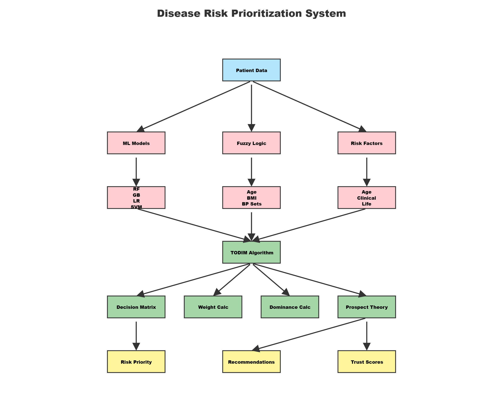
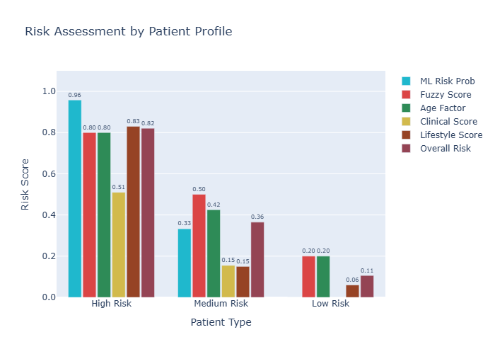

Disease Risk Prioritization System

A comprehensive healthcare decision support system that combines 
**Multi-Criteria Decision Making (MCDM)**, **Fuzzy Logic**, and 
**Machine Learning** to prioritize disease risks for patients.

> Developed as part of research internship at **IIT Delhi, 
Department of Management Studies**

---

Methodology

This system integrates three powerful approaches:

| Component | Purpose |
|-----------|---------|
| TODIM Algorithm | Multi-criteria ranking with Prospect Theory |
| Fuzzy Logic | Handles uncertainty in medical diagnosis |
| ML Ensemble (6 models) | Pattern recognition and risk prediction |

---

System Architecture

---

Risk Assessment

---

ML Models Used

- Random Forest
- Gradient Boosting
- Logistic Regression
- Support Vector Machine (SVM)
- Naive Bayes
- Decision Tree

> Best model: **SVM with 91.67% accuracy**

---

Diseases Analyzed

- Cardiovascular Disease
- Type 2 Diabetes
- Hypertension
- Obesity-related Disorders
- Metabolic Syndrome

---

Project Structure
'''
disease-risk-prioritization/
├── src/
│   ├── todim_algorithm.py     # TODIM with Prospect Theory
│   ├── fuzzy_logic.py         # Fuzzy inference system
│   ├── ml_predictor.py        # ML ensemble pipeline
│   └── integrated_system.py  # Core integration logic
├── analysis/
│   ├── demonstration.py       # Full system demo
│   ├── detailed_analysis.py   # Component analysis
│   ├── summary.py             # Project summary
│   └── practical_usage.py     # Usage examples
├── visualizations/
│   ├── risk_chart.py          # Risk assessment chart
│   └── flowchart.py           # System flowchart
├── assets/                    # Generated charts
├── main.py                    # Entry point
└── requirements.txt
'''
---

Setup & Run

1. Clone the repo
git clone https://github.com/prachimadaan11/disease-risk-prioritization.git

2. Install dependencies
pip install -r requirements.txt

3. Run the system
python main.py

---

Sample Output
Disease Risk Prioritization (Top 3):

Hypertension: 0.923 (HIGH)
Cardiovascular Disease: 0.871 (HIGH)
Metabolic Syndrome: 0.654 (MEDIUM)

ML Assessment: High Risk
Fuzzy Score: 0.8
Trust Score: 1.0

---

Key Innovations

- Prospect Theory integration for behavioral risk modeling
- Fuzzy logic for handling diagnostic uncertainty
- Trust factor assessment for data quality
- Multi-disease simultaneous prioritization
- Personalized clinical recommendations

---